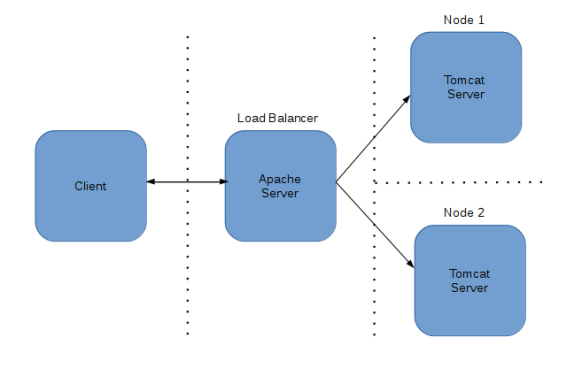

## Load Balancer with Apache

The following procedure demonstrates the way we can configure Apache Tomcat server to use load-balancing with the help of Apache server Mod Proxy OR JK_MOD plugin .

### How it works?



### Software

| Name | Link |
| --- | --- |
| JRE | [Adopt Open JRE 8](https://github.com/AdoptOpenJDK/openjdk11-binaries/releases/download/jdk-11.0.9.1%2B1/OpenJDK11U-jdk_x64_windows_hotspot_11.0.9.1_1.msi) |
| Apache Server | [<i class="fa fa-external-link"></i>](https://httpd.apache.org/download.cgi#apache24) |
| Tomcat Server | [<i class="fa fa-external-link"></i>](https://tomcat.apache.org/download-90.cgi) | 
| Apache MOD JK Plugin | [<i class="fa fa-external-link"></i>](http://tomcat.apache.org/download-connectors.cgi) |

### Setup Using Proxy Module

Configuring Tomcat Load Balancer with Apache web server using Mod Proxy is quite easy. 

**Step - 1:** Edit httpd.conf file in the ${APACHE_SERVER_HOME}/conf folder to enable proxy_module, proxy_balancer_module and proxy_http_module modules.

```script
LoadModule proxy_module modules/mod_proxy.so
LoadModule proxy_balancer_module modules/mod_proxy_balancer.so
LoadModule proxy_http_module modules/mod_proxy_http.so
```

**Step - 2:** Add proxy pass along with balancer name for application context root. In this example, I have a proxy path as TOMCAT_WEB_APPLICATION and balancer name as APACHE_BALANCER. Very important to include stickysession; as not having this option will have session expiry issues in an application.
Edit httpd.conf file in the ${APACHE_SERVER_HOME}/conf folder.

```script
<IfModule proxy_module>
	ProxyRequests Off
	ProxyPass /TOMCAT_WEB_APPLICATION balancer://APACHE_BALANCER stickysession=JSESSIONID
	ProxyPassReverse /TOMCAT_WEB_APPLICATION balancer://APACHE_BALANCER stickysession=JSESSIONID
	<Proxy balancer://APACHE_BALANCER>
		BalancerMember http://TOMCAT_SERVER_HOST:HTTP_PORT/TOMCAT_WEB_APPLICATION route=server1
		BalancerMember http://TOMCAT_SERVER_HOST:HTTP_PORT/TOMCAT_WEB_APPLICATION route=server2
	</Proxy>
</IfModule>
```

**Pros:**
 - No need for a separate module compilation and maintenance. mod_proxy, mod_proxy_http, mod_proxy_ajp and mod_proxy_balancer comes as part of standard Apache 2.2+ distribution
 - Ability to use http https or AJP protocols, even within the same balancer.

**Cons:**
 - mod_proxy_ajp does not support large 8K+ packet sizes.
 - Basic load balancer
 - Does not support Domain model clustering

### Setup Using JK Module

A load balancer is a worker that does not directly communicate with Tomcat. Instead it is responsible for the management of several "real" workers, called members or sub workers of the load balancer.

**Step - 1:** Edit httpd.conf file in the ${APACHE_SERVER_HOME}/conf folder by adding the following line:

```script
LoadModule jk_module modules/mod_jk.so
```

**Step - 2:** Create new file worker.properties in ${APACHE_SERVER_HOME}/conf folder. 
```script
worker.list=balancer,status

worker.tomcat1.type=AJP13
worker.tomcat1.port=AJP13_PORT_TOMCAT1
worker.tomcat1.host=TOMCAT_SERVER_HOST_TOMCAT1

worker.tomcat2.type=AJP13
worker.tomcat2.port=AJP13_PORT_TOMCAT2
worker.tomcat2.host=TOMCAT_SERVER_HOST_TOMCAT2

worker.balancer.type=lb
worker.balancer.balance_workers=tomcat1, tomcat2
worker.status.type=status
```
For more information about setting up the worker configuration file, see [Apache Tomcat Connectors documentation](https://tomcat.apache.org/connectors-doc/reference/apache.html).

**Step - 3:** Modify the httpd.conf file by adding load-balancer settings and pointing to the worker.properties file.
```script
# Load balancer settings
JkWorkersFile ${APACHE_SERVER_HOME}/conf/worker.properties
JkShmFile ${APACHE_SERVER_HOME}/logs/mod_jk.shm
JkLogFile ${APACHE_SERVER_HOME}/logs/mod_jk.log
JkLogLevel error
JkMount /status status
JkMount /* balancer
JkOptions +ForwardURIProxy
JkOptions +ForwardURICompatUnparsed
```
Three options are available to ensure that the logs forwarded by HTTPD are left with the original Tomcat URL:
**JkOptions +ForwardURIProxy** The forwarded URI is partially reencoded after processing inside Apache and before forwarding to Tomcat. This option is compatible with local URL manipulation by mod_rewrite and with URL-encoded session IDs.  
**JkOptions +ForwardURICompatUnparsed** The forwarded URI is unparsed, and is spec-compliant and secure. This option always forwards the original request URI, so rewriting URIs with mod_rewrite and then forwarding the rewritten URI does not work.
**JkOptions ForwardURICompat** The forwarded URI is decoded by Apache. Encoded characters are decoded and explicit path components such ".." are already resolved. This option is less spec-compliant and is not safe if you are using prefix JkMount. This option allows the rewriting of URIs with mod_rewrite before forwarding.

**Step - 4:** Set up AJP/1.3 connectors on the load-balanced Apache Tomcat servers. For each Tomcat server, edit the ${TOMCAT_HOME}/conf/server.xml file to add an AJP13 connector. Attribute 'redirectPort' should contain HTTP / HTTPs connector port.

```script
<Connector port="port" protocol="AJP/1.3" redirectPort="8443" 
maxThreads="150"> 
</Connector>
```
Note:  If you have HTTPS set up, copy your HTTPS-enabled connector settings.

**Pros:**
 - Advanced load balancer
 - Advanced node failure detection
 - Support for large AJP packet sizes

**Cons:**
 - Need to build and maintain a separate module
 
 ### Blog Owner Information:

| Description | Github Profile Link  | LinkedIn Profile Link | Email Address
| -------- | -------- | -------- | -------- |
| Bhushan Patil | [<i class="fa fa-external-link"></i>](https://github.com/ravaan-techky/) | [<i class="fa fa-external-link"></i>](https://www.linkedin.com/in/bhushan-patil-1bbab528/) | [ravaan.techky@gmail.com](mailto:ravaan.techky@gmail.com) |

<br/><br/>
[<i class="fa fa-arrow-left"></i> **Back**](/documentation/)
