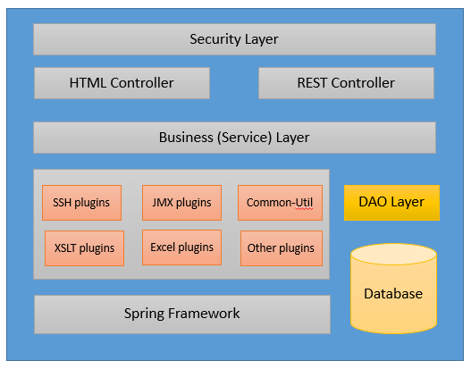

## Project_Name
One Line Summary

### Overview:
Project Overview....Audience who should get benifits from this project.

### Project Layers:

| Layers | Available | Technology |
| ------ | ------ | ------ |
| Client side layer | Yes / No | Angular / JQuery / JavaScript |
| Cascade style layer | Yes / No | CSS / SCSS |
| Server Web layer | Yes / No | Spring Boot / Struts2 |
| Service layer | Yes / No | Spring Boot / Core Java |
| Database layer | Yes / No | MySQL / MongoDB / Influx DB |

### Technology Stack :

| Technology | Version |
| ------- | ------- |
| Spring Boot | 2.0.8 |
| Core Java | Adopt Open JDK |
| Angular | 9.0 |
| MySQL | 5.6.0 |

### Benifits:

- Module 1
  - Benifit 1
  - Benifit 2
  - ....
- Module 2
  - Benifit 1
  - Benifit 2
  - ....

### Architecture Overview:

  

### Important Links:

| Description | Link |
| -------- | -------- |
| Source Code | <i class="fa fa-download"></i> |
| Circle CI <If Available> | <i class="fa fa-external-link"></i> |
| Documentation | <i class="fa fa-folder-open"></i> |
  
### Developer Information:

| Description | Github Profile Link  | LinkedIn Profile Link | Email Address
| -------- | -------- | -------- | -------- |
| First_Name1 Last_Name1 | [<i class="fa fa-external-link"></i>](#) | [<i class="fa fa-external-link"></i>](#) | [abc@gmail.com](mailto:abc@gmail.com) |
| First_Name2 Last_Name2 | [<i class="fa fa-external-link"></i>](#) | [<i class="fa fa-external-link"></i>](#) | [abc@gmail.com](mailto:abc@gmail.com) |
| First_Name3 Last_Name3 | [<i class="fa fa-external-link"></i>](#) | [<i class="fa fa-external-link"></i>](#) | [abc@gmail.com](mailto:abc@gmail.com) |

  
[<i class="fa fa-arrow-left"></i> **Back**](/documentation/)
